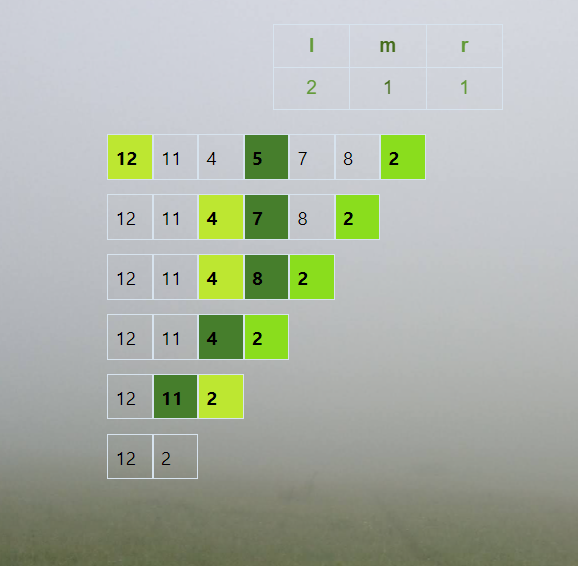

# The importance of left-right pointer locker

## Theoretical reasoning
It's always a good idea to have some kind of barrier between the range edges' pointers in search / sort algorithms. This is due to the very nature of the ideas, these algorithms are build upon, that most likely **imply** that the left edge is always supposed to be lesser or equal than the right one. And whether the condition is kept true or not is a question of whether the algorithm still works at its heart as it was supposed to.   
What you get by ensuring such a locker is always in place is an additional verification of algorithm logic being implemented in a way the theoretical boundaries were demanding it to be.

## On-spot analysis
Let's take a closer look at the possible outcomes for the pair of edge pointers **l = n** and **r = n + 1** if **array[n]** is not the sought value ***i*** (cause m == n, hence that would've been the end of a recursion) and the array is not yet empty:
1. l is **0** and r is **length - 1** if n == 0;
2. l is **n** and r is **n - 1** if **array[n - 1]** > ***i***;
3. l is **n - 1** and r is **n** if **array[n - 1]** <= ***i***;  

Summarised:

| Case | l | m | r |
| :-- | :--: | :--: | :--: |
| before | n | n | n + 1 | 
| n == 0 | 0 | (length - 1) / 2 | length - 1 |
| array[n - 1] > i | n | n - 1 | n - 1 |
| array[n - 1] <= i | n - 1 | n - 1 | n |

Essentially, case 1 is totally fine. Case 3 is a steady slide down and is also fine as it keeps the order of edge pointers unchanged.  

The 2nd case is the one interesting here as it allows the right-end pointer to slip down through the left one. Why is it so dangerous and what might it lead to?

Suppose having an array where we get into steady slide at the atmost right edge with **l = length - 2** and **r = length - 1**. Then the trick with fall-through happens and **l is 1 less than r and m**. As long as element **length - 2** is less than ***i*** we keep eliminating it and sliding down left. The issue appears when we meet 2 elements larger than ***i*** back to back. Let N = length - 1. That moment we do these things:
- calculate **l**, **r** and **m** as **N**, **N - 1**, **N - 1**
- remove element **N - 1**, thus making length of an array **N - 1**
- try to run the algorithm for **l = N - 1** and **r = N - 2**
And here is the issue: the largest element left in an array is the element **N - 2**, while **l** points to a cell no longer used.  

***Memory violation***.

## An illustrated experiment
We'll use the [tool for visualization](https://yanefingon.github.io/Mawa-Search-Algorithm-Visualization/) and will try to run the simulation for following ***array*** and **value**: ***[12, 11, 4, 5, 7, 8, 2]*** and **9**.

What we do see here is exactly what we were able to predict theoretically in the section prior.
We began with a row of elements lesser than the ***one sought*** which lead us to **n <=> n + 1** position which kept traversing down till the element which happened to be bigger than the ***one sought***.  
At this point **r** slipped 1 position through **l**. The following step we get a bigger element than the **sought one**. And this causes **l** to point to the out-of-array-range memory.  
At last, the next step causes the controller to terminate the run as the memory is violated.